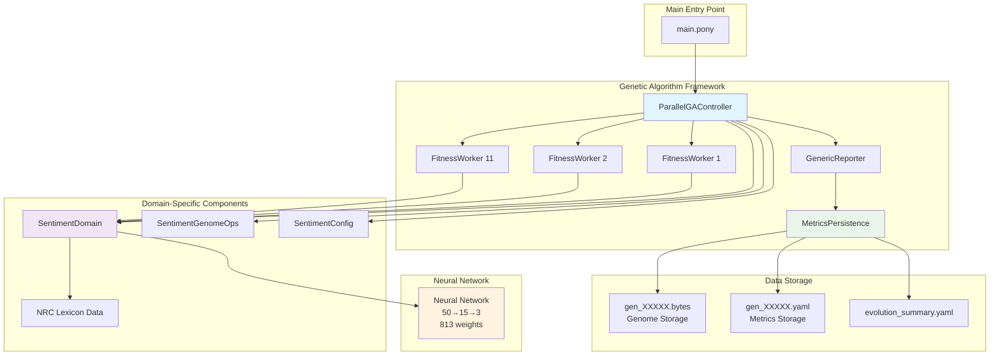

# Sentiment Analysis with Genetic Algorithm

A multilingual sentiment classification system built with Pony language, using genetic algorithms to evolve neural network weights for optimal text sentiment detection.

## 🎯 Overview

This project implements a 3-class sentiment classifier (positive, negative, neutral) that supports both English and Spanish text analysis. The system uses a genetic algorithm to evolve neural network weights, with parallel fitness evaluation using Pony's actor model.

## 🏗️ Architecture

The system is built with a modular, parallel architecture consisting of several key components:



## 📁 Project Structure

```
sentiment/
├── main.pony                    # Entry point and command handling
├── core/
│   ├── sentiment_domain.pony    # Problem domain implementation
│   ├── sentiment_config.pony    # GA configuration parameters
│   └── sentiment_ops.pony       # Genome operations (mutation, crossover)
├── _framework/
│   ├── parallel_ga.pony         # Main GA coordinator actor
│   ├── ga_controller.pony       # GA evolution logic
│   ├── interfaces.pony          # Core interfaces and traits
│   ├── reporter.pony           # Progress reporting and logging
│   ├── metrics_persistence.pony # YAML metrics storage
│   └── persistence.pony        # Binary genome storage
├── data/
│   ├── English-NRC-EmoLex.txt  # English emotion lexicon
│   └── Spanish-NRC-EmoLex.txt  # Spanish emotion lexicon
└── bin/                        # Generated files
    ├── sentiment               # Compiled binary
    ├── gen_XXXXX.bytes        # Genome storage files
    ├── gen_XXXXX.yaml         # Evaluation metrics files
    └── evolution_summary.yaml  # Evolution run summary
```

## 🧠 Neural Network Architecture

- **Input Layer**: 50 features extracted from text
  - Word counts, punctuation analysis
  - NRC emotion lexicon matches
  - Language detection scores
  - Text length and complexity metrics

- **Hidden Layer**: 15 neurons with sigmoid activation

- **Output Layer**: 3 neurons (positive, negative, neutral)

- **Total Weights**: 813 parameters evolved by GA

## 🔬 Feature Extraction

The system extracts 50 features from input text:

1. **Basic Text Features** (10 features)
   - Word count, character count
   - Average word length
   - Punctuation counts (!?.,;:)
   - Uppercase ratio

2. **NRC Emotion Lexicon Features** (30 features)
   - Positive/negative word counts
   - Emotion intensity scores
   - Language-specific sentiment indicators

3. **Language Detection** (10 features)
   - English vs Spanish word ratios
   - Language confidence scores

## 🧬 Genetic Algorithm Configuration

- **Population Size**: 30 genomes
- **Worker Count**: 11 parallel actors
- **Mutation Rate**: 10%
- **Crossover Rate**: 80%
- **Elitism**: Top 3 genomes preserved
- **Selection**: Tournament selection with size 3

## 💾 Data Persistence

The system saves comprehensive data for every generation:

### Genome Storage (`gen_XXXXX.bytes`)
Binary files containing the 813 neural network weights as raw bytes.

### Metrics Storage (`gen_XXXXX.yaml`)
YAML files with detailed evaluation metrics:
```yaml
generation: 100
timestamp: 1757270412
fitness:
  best: 0.866667
  average: 0.745333
accuracy:
  training: 0.85
  test: 0.90
  combined: 0.866667
genome:
  size: 813
  file: gen_00100.bytes
sample_predictions:
  hate: "negative"
  love: "positive"
  table: "neutral"
```

### Evolution Summary (`evolution_summary.yaml`)
Complete run configuration and results:
```yaml
total_generations: 1000
best_fitness: 0.95
best_generation: 847
configuration:
  population_size: 30
  worker_count: 11
  mutation_rate: 0.1
  crossover_rate: 0.8
neural_network:
  input_features: 50
  hidden_neurons: 15
  output_classes: 3
  total_weights: 813
```

## 🚀 Usage

### Training from Scratch
```bash
./pony run sentiment train
```

### Resume Training
```bash
# Resume with automatic stopping at target fitness
./pony run sentiment resume

# Resume for specific number of generations (ignores target fitness)
./pony run sentiment resume 5000
```

### Analyze Text
```bash
./pony run sentiment analyze "I love this amazing movie!"
./pony run sentiment analyze "Esta película es terrible"
```

### Clear Saved Models
```bash
./pony run sentiment clear
```

### Test with Examples
```bash
./pony run sentiment test
```

## 🔄 Parallel Processing Flow

1. **Population Initialization**: 30 random genomes created
2. **Parallel Evaluation**: Genomes distributed across 11 worker actors
3. **Fitness Calculation**: Each worker evaluates genomes using test dataset
4. **Results Collection**: Main controller gathers all fitness scores
5. **Selection & Reproduction**: Best genomes selected for next generation
6. **Metrics Persistence**: Both genome bytes and evaluation metrics saved
7. **Repeat**: Process continues until target fitness or generation limit

## 🎛️ Classification Logic

The system uses smart classification logic to handle ambiguous cases:

```pony
// If negative and neutral are close but both much higher than positive
if (neg_neutral_diff < 0.05) and (pos_avg_diff > 0.20) then
  predicted_class = 1  // Classify as Negative
end
```

This ensures that clearly negative text like "your brother is an asshole" gets correctly classified as negative rather than neutral.

## 📊 Performance Monitoring

- **Real-time Progress**: Generation-by-generation fitness tracking
- **Comprehensive Metrics**: All generations saved with full evaluation data
- **Evolution History**: Complete traceability of genetic algorithm progress
- **Comparative Analysis**: Tools for comparing different generations

## 🛠️ Technical Details

**Language**: Pony (actor-model concurrency)
**Concurrency**: 11 parallel worker actors
**Data Source**: NRC Emotion Lexicon (multilingual)
**Storage Format**: Binary genomes + YAML metrics
**Classification**: 3-class sentiment (positive/negative/neutral)

## 📈 Example Output

```
gen=100 best=0.866667 avg=0.745333
gen=200 best=0.893333 avg=0.812222
gen=300 best=0.916667 avg=0.834567

Evolution completed!
Final fitness: 0.95
Generation: 1247

Text: "I love this movie, it's amazing!"
Sentiment: Positive (87.23%)
```

The system provides confidence scores and detailed breakdowns for each classification, making it suitable for both automated processing and human review.